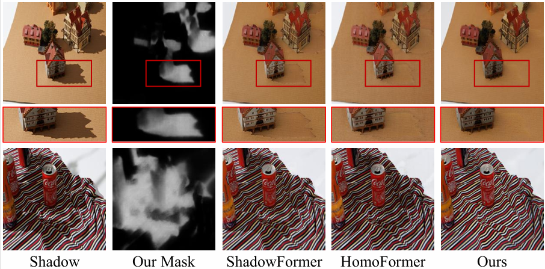

# Illumination-aware Softmask Guided Shadow Removal


## 🧠 Method


## 📊 Results
<p align="center">
  
</p>


## 🛠️ Requirements
```
Python	3.8
PyTorch	1.10+
CUDA	11.3 (recommended)
```

## 📂 Project Structure


## ▶️ Usage

### 🏋️ Train
```bash
python train.py 
```

### 🖊️ Test
```bash
python test.py
```

### 📥 Dataset

Please download datasets from:

ISTD+

ISTD

SRD

WRSD+

## 🙏 Acknowledgement

Thanks to previous shadow removal works.

## 📧 Contact

For any questions, please open an issue or contact: [236004855@nbu.edu.cn](mailto:236004855@nbu.edu.cn)