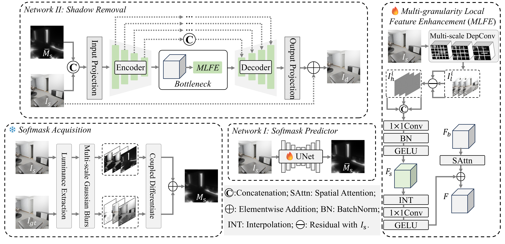
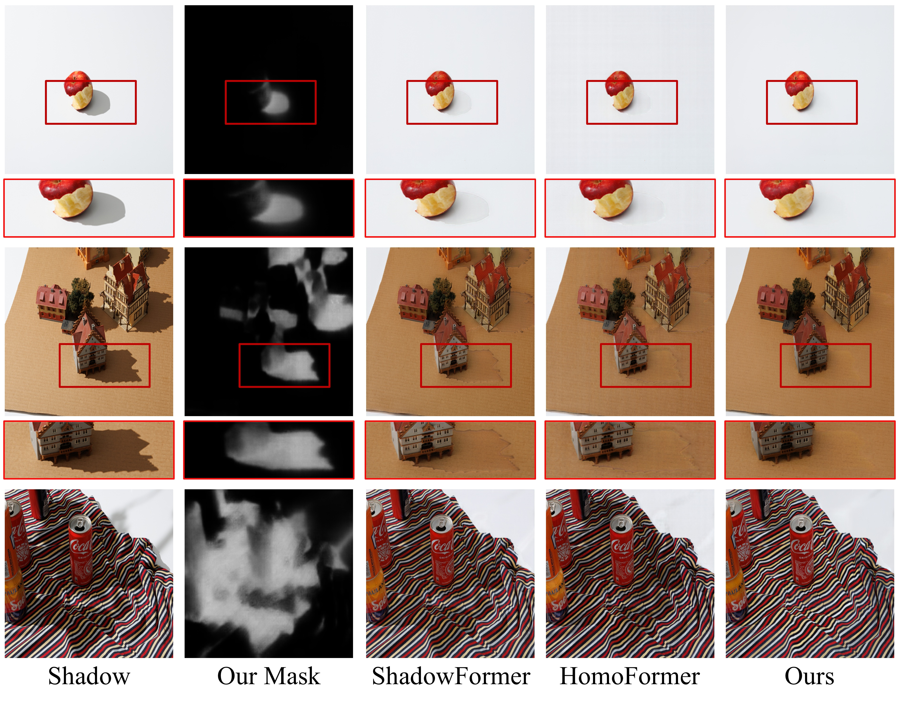

<h1 align="center">Illumination-aware Softmask Guided Shadow Removal (JVCI 2026)</h1>

<div align="center">
  <a href="https://github.com/welemon7/Softmask">
    
  </a>

  

  

  
</div>

## 🧠 Introduction

While recent learning-based methods have boosted the performance of shadow removal, a major challenge persists: most leading approaches rely on manually annotated ground-truth masks as auxiliary priors. However, acquiring such manual annotations is costly, and model performance often degrades sharply without ground-truth mask guidance. To tackle this problem, we propose a multi-scale illumination-aware softmask generation method. Specifically, we compute the luminance ratio between the shadow image and its shadow-free counterpart, followed by multi-scale filtering and fusion to produce a coherent softmask. This softmask is learned and predicted via a shallow network, which subsequently guides the restoration process. Compared to binary ground-truth masks, our approach yields softmask with improved coherence and more accurate preservation of edge gradients. Furthermore, we introduce a synergistic fusion of structural feature derived from self-extracted multi-scale representations using Gaussian kernels, which effectively retains structural information within shadowed regions.

For more details, please refer to our [original paper](https://github.com/welemon7/Softmask)

<p align="center">
  
</p>

## 📊 Results
#### Evaluation on WRSD+
The evaluation results on WRSD+ are as follows:
| Method | PSNR | SSIM | RMSE |
| :-- | :--: | :--: | :--: |
| Input Image | 18.87 | 0.825 | 14.76 |
| UFormer | 25.68 | 0.919 | 6.93 |
| ShadowFormer | 25.64 | 0.918 | 7.04 |
| HomoFormer | 25.87 | 0.914 | 7.03 |
| RASM | 25.68 | 0.920 | 6.88 |
| **Ours** | **26.29** | **0.923** | **6.63** |

#### Visual Results
<p align="center">
  
</p>

#### Testing results
The testing results on WRSD dataset [WRSD+](https://drive.google.com/drive/folders/1YqdkGQO2XRHkyyQ-rwxhNJu1a5oIE4Fl?usp=sharing)

The testing softmask results on WRSD dataset [WRSD+_softmask](https://drive.google.com/drive/folders/1ofkdFkuYyTMR7UnxR32o3VuopzvFUEPI?usp=sharing)

## 🛠️ Requirements
```
Python	3.8
PyTorch	2.7.1
CUDA	12.8
```

## 📂 Project Structure


## ▶️ Usage

### 🏋️ Train
1. Download datasets 
```
|-- WRSD+ Dataset
    |-- train
        |-- shadow # shadow image
        |-- non_shadow # shadow-free GT
    |-- test
        |-- shadow # shadow image
        |-- non_shadow # shadow-free GT
```
2. You can modify the following terms in `option.py`
```python
train_dir  # training set path
test_dir   # testing set path
softmask_dir # testing set path
gpu: 0 # Our model can be trained using RTX 4090 GPU. You can also input "CUDA_VISIBLE_DEVICES=0,1 python train.py".
```
3. Train the network
```bash
python train_softmask.py
python train.py 
```

### 🖊️ Test
```bash
python test_softmask.py
python test.py
```

### 📥 Dataset

Please download datasets from:

* ISTD+ [[link](https://github.com/cvlab-stonybrook/SID)]

* ISTD [[link](https://github.com/DeepInsight-PCALab/ST-CGAN)]

* SRD [[link](https://github.com/vinthony/ghost-free-shadow-removal)]

* WRSD+ [[link](https://github.com/movingforward100/Shadow_R)]

## 🙏 Acknowledgement

Thanks to previous shadow removal works [ShadowFormer](https://github.com/guolanqing/shadowformer), [HomoFormer](https://github.com/jiexiaou/HomoFormer)... and 2742.

## 📧 Contact

For any questions, please open an issue or contact: [236004855@nbu.edu.cn](mailto:236004855@nbu.edu.cn)
